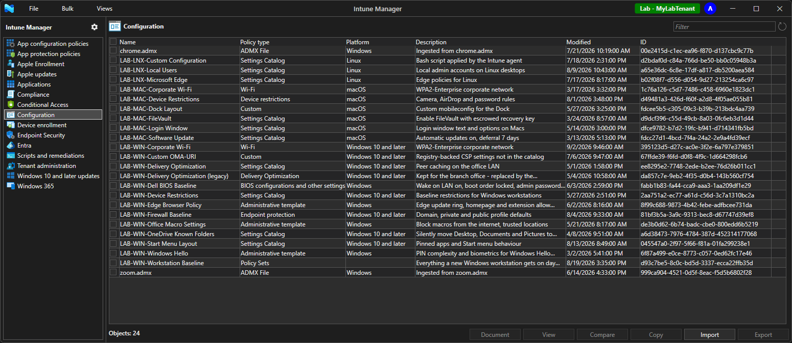

# IntuneManagement

A PowerShell module and desktop app for managing Microsoft Intune and Entra configuration
through the Microsoft Graph API: export, import, copy, compare, bulk-assign, bulk-tag,
delete and document policies - across 67 policy types, from a UI or from a script.

**Version 4.0.0-beta1.** 4.0 is a rewrite of the 3.x tool. It runs on Windows, macOS and
Linux, on PowerShell 5.1 and 7, and every UI operation is also a public command for
pipelines and scheduled runs. See [ReleaseNotes.md](ReleaseNotes.md) for what changed
and what is known not to work yet.

> This is a beta. Test it against a lab tenant before pointing it at production.



The same application on [macOS](Docs/images/main-macos.png) and [Linux](Docs/images/main-linux.png).

## Contents

- [Coming from 3.x](#coming-from-3x)
- [Requirements](#requirements)
- [Getting started](#getting-started) - [Windows](#windows) / [macOS](#macos) / [Linux](#linux)
- [Bundled binaries](#bundled-binaries)
- [Start arguments](#start-arguments)
- [Signing in](#signing-in)
- [UI or script - the same operations](#ui-or-script---the-same-operations)
- [Supported policy types](#supported-policy-types)
- [Documentation output](#documentation-output)
- [Where to read more](#where-to-read-more)

## Coming from 3.x

Most of what you know still applies: the same policy groups in the left nav, the same
export folder layout, the same import/copy/compare flows. What breaks if 4.0 simply
replaces 3.x:

- **Pipelines and scheduled jobs.** The `-Silent -SilentBatchFile` mode and its
  `BulkExport.json` / `BulkImport.json` files are gone, and so are the launcher switches
  for tenant, app and secret. Rewrite against the public commands: `Connect-IMIntuneManagement`
  for credentials, `Start-IMGraphBulkExport` and friends for the work. The
  [same operations](#ui-or-script---the-same-operations) table and
  [Docs/Examples.md](Docs/Examples.md) show the shape.
- **Settings start blank.** 4.0 keeps its settings under its own registry key
  (`HKCU\Software\IntuneManagement`) and does not read the 3.x key or JSON file. Enter the
  custom app id, export folders and documentation options again. The registry is still the
  default on Windows; a JSON file or an in-memory store can be used instead, which is what
  makes unattended runs clean. See [Docs/Settings.md](Docs/Settings.md).
- **Sign in again.** The token cache is per version, so the first start of 4.0 is a fresh
  sign-in.
- **Two export folders changed case.** `AutoPilot` became `Autopilot` and
  `HardwareConfigurations` became `hardwareConfigurations`. A 3.x export still imports, since
  import matches folder names case-insensitively; a script that builds the path, or a Linux
  file system, sees two names. Every other folder keeps its 3.x name and the JSON is
  compatible both ways.
- **Two policy types are not in 4.0:** Intune *Locations*, which Microsoft removed from
  the service, and the iOS DEP enrollment profile. Both were already disabled in 3.x, so no
  existing export is affected.
- **Scripts that imported the extension files.** It is one module now,
  `Import-Module .\IntuneManagement.psd1`, and only the `IM`-prefixed exported commands are
  supported.

Different, but not breaking:

- **Cross-tenant import creates only the groups a policy references.** 3.x created every
  exported group.
- **Two authentication providers**, MSAL (default) and OAuth, and interactive sign-in opens
  the system browser. See [Signing in](#signing-in).

## Requirements

| | Windows | macOS | Linux |
|---|---|---|---|
| PowerShell | Windows PowerShell 5.1, or PowerShell 7 | PowerShell 7.4+ (`pwsh`) | PowerShell 7.4+ (`pwsh`) |
| UI toolkit | WPF (default) or Avalonia | Avalonia | Avalonia |
| .NET | comes with PowerShell | comes with `pwsh` | comes with `pwsh` |

Nothing else is installed. `pwsh` bundles its own .NET runtime; the Avalonia binaries
ship in `Bin/Avalonia`.

An **Entra app registration** is needed for unattended sign-in (client secret or
certificate) and for the OAuth provider. Interactive sign-in with the MSAL provider uses
Microsoft's public Graph PowerShell app id by default, so it works with no registration
at all. The permissions the tool uses, as application or delegated permissions:

```
DeviceManagementConfiguration.ReadWrite.All   DeviceManagementApps.ReadWrite.All
DeviceManagementServiceConfig.ReadWrite.All   DeviceManagementScripts.ReadWrite.All
DeviceManagementRBAC.ReadWrite.All            Policy.ReadWrite.ConditionalAccess
Agreement.ReadWrite.All                       Organization.ReadWrite.All
CloudPC.ReadWrite.All                         Group.ReadWrite.All   (cross-tenant import creates groups)
```

Grant the `.Read.All` variants instead for a read-only identity - the left nav marks
the types that identity cannot change.

A custom app registration used for interactive sign-in must also allow
`http://localhost` as a redirect URI, under *Mobile and desktop applications*: interactive
sign-in runs in the system browser by default, and that is the only redirect a browser
flow can use. Microsoft's Graph PowerShell application already allows it. See
[Signing in](#signing-in).

## Getting started

Clone or download the repository. There is no build step and no installer.

### Windows

```powershell
.\Start.cmd                 # Windows PowerShell 5.1 - double-click works too
.\Start-PS7.cmd             # the same window, on PowerShell 7
.\Start.ps1 -ShowUI         # from a PowerShell prompt, on either one (WPF)
```

To run the cross-platform Avalonia UI on Windows instead - the same UI macOS and Linux
get - use `.\UI\Avalonia\Start-Avalonia.ps1` from PowerShell 7.

### macOS

```sh
./Start-Avalonia.command    # double-click in Finder works too
```

The launcher runs `pwsh` with a small startup hook so the GUI owns the process's main
thread, which macOS requires. Do not import the module into an ordinary `pwsh` session
and call `Show-IMMainWindow` on macOS - the native toolkit will refuse. Signing in opens
the system browser; the token cache uses the Keychain.

The hook is a prebuilt 10 KB .NET assembly, `Bin/MainThreadHook/IntuneManagement.MainThreadHook.dll`,
committed so that a plain clone runs without a build step. Its source is in the repository
(`UI/Avalonia/Bootstrap/MainThreadHook/StartupHook.cs`) and you can rebuild it yourself
with `UI/Avalonia/Bootstrap/Publish-MainThreadHook.ps1` (needs the .NET 8 SDK).
What it does, and why one build works across
every pwsh 7.4+ release, is in [Docs/CrossPlatform.md](Docs/CrossPlatform.md#the-macos-main-thread-hook).
It is only engaged on macOS; on Linux the same launcher starts `pwsh` normally.

### Linux

```sh
./Start-Avalonia.command
# or
pwsh -NoProfile -File ./UI/Avalonia/Start-Avalonia.ps1
```

Signing in opens the system browser. The token cache uses libsecret (gnome-keyring or
KWallet); on a box with no keyring daemon you sign in every session. The `Default` theme
follows the GNOME colour scheme; other desktops resolve to Light unless a theme is set.

Off Windows, three things degrade with a log line rather than an error: Word
documentation output, MSI property extraction on app import, and the WAM broker (sign-in
falls back to the browser). See [Docs/CrossPlatform.md](Docs/CrossPlatform.md).

### Headless

```powershell
Import-Module .\IntuneManagement.psd1
Connect-IMIntuneManagement -TenantId contoso.onmicrosoft.com -AppId <app-id> -Secret <secret>
```

**Trimming the deployment.** For a build agent or a runbook worker, the module runs
from a much smaller copy:

- **Delete the `UI` folder** and no UI toolkit ever loads, on every platform, with no
  configuration. (Setting `IM_UI_BACKEND=None` does the same without deleting anything.)
  The only command that disappears is `Show-IMMainWindow`.
- **Delete the `Bin` folder too if you sign in with the OAuth provider.** OAuth is pure
  PowerShell; `Bin` holds only the MSAL.NET assemblies, the Avalonia binaries and the
  macOS hook - 67 MB. Set the provider for the deployment with `IM_AUTH_PROVIDER=OAuth`
  or the saved *Active authentication provider* setting, so MSAL is never asked to
  resume a session at startup.

What is left - `Classes`, `Config`, `Internal`, `Public`, the manifest - is plain script.

## Bundled binaries

Everything under `Bin` is a stock build of a public package - nothing is patched. The
table says where each one comes from so it can be verified or replaced.

| Folder | Contents | Version | Source | Rebuild / restore |
|---|---|---|---|---|
| `Bin/MSAL_PS7` | MSAL.NET for PowerShell 7: `Microsoft.Identity.Client` + `.Broker`, `.Desktop`, `.Extensions.Msal`, `.NativeInterop`, `Microsoft.IdentityModel.Abstractions`, `msalruntime` (x64 / x86 / arm64) | MSAL 4.88.0, NativeInterop 0.20.6, IdentityModel.Abstractions 8.18.0 | NuGet: [Microsoft.Identity.Client](https://www.nuget.org/packages/Microsoft.Identity.Client), [.Broker](https://www.nuget.org/packages/Microsoft.Identity.Client.Broker), [.Desktop](https://www.nuget.org/packages/Microsoft.Identity.Client.Desktop), [.Extensions.Msal](https://www.nuget.org/packages/Microsoft.Identity.Client.Extensions.Msal), [.NativeInterop](https://www.nuget.org/packages/Microsoft.Identity.Client.NativeInterop) | No script. Download the packages and copy the `net8.0` (PS7) or `net462` (PS5) build from each package's `lib` folder (`netstandard2.0` where that is all a package ships); `msalruntime*.dll` come from `runtimes/win-*/native` in NativeInterop |
| `Bin/MSAL_PS5` | The same MSAL set built for .NET Framework 4.6.2, plus the BCL shims it needs on 5.1: `System.Text.Json` 6.0, `System.Memory`, `System.Buffers`, `System.Numerics.Vectors`, `System.Runtime.CompilerServices.Unsafe`, `System.Text.Encodings.Web`, `System.Threading.Tasks.Extensions`, `Microsoft.Bcl.AsyncInterfaces` | MSAL 4.88.0 | NuGet, same packages; the shims are their declared dependencies | As above |
| `Bin/Avalonia` | The Avalonia UI toolkit and its native renderers: `Avalonia.*`, `Avalonia.Controls.DataGrid`, `Avalonia.Themes.Fluent`, `Avalonia.Fonts.Inter`, `SkiaSharp` + `HarfBuzzSharp` (with `.dll`/`.dylib`/`.so` natives for all three platforms), `libAvaloniaNative.dylib`, `av_libglesv2.dll`, `Tmds.DBus.Protocol`, `MicroCom.Runtime` | Avalonia 11.2.3; SkiaSharp 2.88.9 and HarfBuzzSharp 7.3.0 as pulled in by Avalonia.Skia | NuGet: [Avalonia](https://www.nuget.org/packages/Avalonia), [Avalonia.Desktop](https://www.nuget.org/packages/Avalonia.Desktop), [Avalonia.Controls.DataGrid](https://www.nuget.org/packages/Avalonia.Controls.DataGrid), [Avalonia.Themes.Fluent](https://www.nuget.org/packages/Avalonia.Themes.Fluent), [Avalonia.Markup.Xaml.Loader](https://www.nuget.org/packages/Avalonia.Markup.Xaml.Loader), [Avalonia.Fonts.Inter](https://www.nuget.org/packages/Avalonia.Fonts.Inter) | `UI/Avalonia/Bootstrap/Restore-AvaloniaBinaries.ps1` publishes [AvaloniaPayload.csproj](UI/Avalonia/Bootstrap/AvaloniaPayload.csproj) (needs the .NET 8 SDK); the package versions are pinned there |
| `Bin/MainThreadHook` | `IntuneManagement.MainThreadHook.dll` - the 10 KB macOS startup hook described under [macOS](#macos) | 1.0.0 | This repository: [UI/Avalonia/Bootstrap/MainThreadHook/StartupHook.cs](UI/Avalonia/Bootstrap/MainThreadHook/StartupHook.cs) | `UI/Avalonia/Bootstrap/Publish-MainThreadHook.ps1`; verify with `Tests/MainThreadHook.Tests.ps1` |

The MSAL assemblies are only used by the MSAL provider, and the `Bin/Avalonia` payload
only by the Avalonia backend, so the module never loads a binary that the chosen
provider and backend do not need. WPF on Windows uses the assemblies that ship with
.NET itself.

## Start arguments

| Entry point | Argument | Effect |
|---|---|---|
| `Start.cmd` / `Start-PS7.cmd` | - | Double-click launchers for the WPF window: Windows PowerShell 5.1 and PowerShell 7. |
| `Start.ps1` | `-ShowUI` | Load the module and show the WPF window. Without it the module is imported for scripting. |
| `Start-Avalonia.ps1` / `.command` | `-ThemeVariant Default\|Light\|Dark` | Theme for this session. `Default` follows the OS. |
| | `-Provider MSAL\|OAuth` | Authentication provider for this session only; does not change the saved setting. |
| | `-NoUI` | Import the module without showing a window. |
| environment | `IM_UI_BACKEND=WPF\|Avalonia\|None` | Which UI backend loads. WPF is the default on Windows; `None` for automation. |
| environment | `IM_AUTH_PROVIDER=MSAL\|OAuth` | Same as `-Provider`, for launch configurations. |
| environment | `IM_THEME_VARIANT=Default\|Light\|Dark` | Same as `-ThemeVariant`. |

## Signing in

Two providers. Pick per connection with `-Provider`; the saved default is MSAL.

| | MSAL (default) | OAuth |
|---|---|---|
| Interactive browser sign-in | yes - system browser, or the WAM broker on Windows | routes to device code |
| Device code | yes | yes |
| Client secret / certificate | yes | yes |
| Managed identity | - | yes (IMDS) |
| Workload identity federation (AKS, GitHub Actions OIDC) | - | yes |
| ROPC (username + password, non-MFA only) | - | yes |
| Dependencies | MSAL.NET, shipped in `Bin/` | none - pure PowerShell |

When no browser can be launched - a server session, a container, SSH - interactive
sign-in falls back to device code automatically. Device code works with MFA, FIDO2 and
security keys because the browser step happens on another device.

**WAM is off by default.** The Windows broker keeps a session alive through the Primary
Refresh Token, and Windows only holds one for the account you signed in to Windows with,
or a work account added under *Settings > Accounts*. Signing in to the tool with any other
account - the normal case for a dedicated admin identity - leaves the broker with a bare
refresh token that Conditional Access can challenge again, so you are prompted roughly
every hour as each access token expires. Turn on **Use Web Account Manager (WAM) for
login** in Settings only when the app account *is* your Windows account; you then get
Windows Hello sign-in and device-compliance claims.

**Interactive sign-in runs in your default browser.** That is the default in 4.0, and the
reason is what the alternatives cannot do: the embedded sign-in window offers password
sign-in only, and the WAM pane fails security keys for an account that is not the Windows
account, a public MSAL.NET report
([#5049](https://github.com/AzureAD/microsoft-authentication-library-for-dotnet/issues/5049))
that reproduced in Microsoft's own Windows App and was closed without a fix. The MSAL team's
own guidance for security keys is the system browser
([#4687](https://github.com/AzureAD/microsoft-authentication-library-for-dotnet/issues/4687)).
In the browser, passkeys, FIDO2 security keys, Windows Hello and phishing-resistant
policies all work, and the sign-in picks up the browser session you already have.

- **Requirement.** The app registration must allow `http://localhost` as a redirect URI
  under *Mobile and desktop applications*. Microsoft's Graph PowerShell application, the
  default, already does. A custom registration that only has the legacy
  `.../oauth2/nativeclient` redirect fails with `AADSTS50011` until the URI is added.
- **To change it.** Turn off **Use system browser for login** in Settings, or run
  `Set-IMSetting -Key UseSystemBrowser -Value $false`, and restart. Sign-in then uses the
  embedded window, or WAM if that is turned on. The system browser takes precedence over
  WAM when both are on.

A token acquired elsewhere can be passed directly with `-Token`. That is the only way to
reach APIs Microsoft does not expose to public client applications (Inventory Policies,
for one). A passed-in token cannot be refreshed.

Several tenants can be signed in at once; every command takes `-TokenId` to say which.

## UI or script - the same operations

Every bulk operation in the UI is a public command. The UI is a thin caller of the same
code, so what you see in one you get in the other.

| In the UI | In a script |
|---|---|
| Bulk > Export | `Start-IMGraphBulkExport -ExportFolder C:\IntuneExport -PolicyGroup DeviceConfiguration` |
| Bulk > Import | `Start-IMGraphBulkImport -ImportFolder C:\IntuneExport -Filter "Baseline"` |
| Bulk > Copy | `Start-IMGraphBulkCopy -CopyFromPattern "Pilot - " -CopyToPattern "Prod - "` |
| Bulk > Delete | `Start-IMGraphBulkDelete -PolicyGroup DeviceConfiguration -Filter "[Test]"` |
| Bulk > Assignments | `Set-IMGraphBulkAssignments -Action Add -Assignments $a -PolicyGroup DeviceConfiguration` |
| Bulk > Scope tags | `Set-IMGraphBulkScopeTags -Action Add -ScopeTagIds 3,4 -PolicyGroup DeviceConfiguration` |
| Bulk > Document | `Start-IMGraphBulkDocumentation -OutputFormat html,md -PolicyGroup Compliance` |
| Select a policy > Export | `Get-IMGraphPolicies -PolicyType CompliancePolicies \| Export-IMGraphPolicy -ExportSettings $s` |
| Select a policy > Copy | `... \| Copy-IMGraphPolicy -Name "Copy of x"` |
| Select two > Compare | `Compare-IMGraphPolicy -Policies @($a, $b)` |

A complete unattended run reads nothing from and writes nothing to the machine:

```powershell
Import-Module .\IntuneManagement.psd1
Use-IMSettingsStore -Memory                          # empty, in-memory settings
Import-IMSettingsStore -Path .\runbook-settings.json # the run's configuration, from source control
Connect-IMIntuneManagement -TenantId $tenant -AppId $app -Secret $secret
Start-IMGraphBulkExport -ExportFolder $out -ExportAssignments $true
```

The full command reference with parameters and examples is
[Docs/CommandReference.md](Docs/CommandReference.md); worked recipes are in
[Docs/Examples.md](Docs/Examples.md).

## Supported policy types

67 types in 16 groups. Every type can be viewed and exported; the table marks the rest.
**Document** says how the documentation engine renders the type: **yes** - a dedicated
renderer that knows the type's settings; **generic** - no dedicated renderer yet, so the
policy documents as its basic information plus one row per property (on by default;
the **Document unsupported types** option turns it off); **-** - not offered for the type.

**App configuration policies**

| Policy type | Import | Export | Copy | Compare | Document | Notes |
|---|:-:|:-:|:-:|:-:|:-:|---|
| App configuration (App) | yes | yes | yes | yes | yes |  |
| App configuration (Device) | yes | yes | yes | yes | yes |  |

**App protection policies**

| Policy type | Import | Export | Copy | Compare | Document | Notes |
|---|:-:|:-:|:-:|:-:|:-:|---|
| App protection policy | yes | yes | yes | yes | yes |  |

**Apple Enrollment**

| Policy type | Import | Export | Copy | Compare | Document | Notes |
|---|:-:|:-:|:-:|:-:|:-:|---|
| Apple Enrollment Types | yes | yes | yes | yes | generic |  |

**Apple updates**

| Policy type | Import | Export | Copy | Compare | Document | Notes |
|---|:-:|:-:|:-:|:-:|:-:|---|
| iOS/iPadOS update policies | yes | yes | yes | yes | yes |  |
| macOS update policies | yes | yes | yes | yes | yes |  |

**Applications**

| Policy type | Import | Export | Copy | Compare | Document | Notes |
|---|:-:|:-:|:-:|:-:|:-:|---|
| Applications | yes | yes | yes | yes | yes | Win32 content (.intunewin) uploads on import when the package is next to the json |
| iOS app provisioning profiles | yes | yes | yes | yes | generic |  |

**Compliance**

| Policy type | Import | Export | Copy | Compare | Document | Notes |
|---|:-:|:-:|:-:|:-:|:-:|---|
| Compliance Policy | yes | yes | yes | yes | yes |  |
| Compliance Policy (Linux) | yes | yes | yes | yes | yes |  |
| Compliance Scripts | yes | yes | yes | yes | yes |  |
| Compliance Scripts (Linux) | yes | yes | yes | yes | yes | Exports to the ReusableSettings folder |
| Notifications | yes | yes | yes | yes | yes |  |

**Conditional Access**

| Policy type | Import | Export | Copy | Compare | Document | Notes |
|---|:-:|:-:|:-:|:-:|:-:|---|
| Authentication Context | yes | yes | yes | yes | yes |  |
| Authentication Strengths | yes | yes | yes | yes | yes |  |
| Conditional Access | yes | yes | yes | yes | yes |  |
| Named Locations | yes | yes | yes | yes | yes |  |
| Terms of use | yes | yes | yes | yes | yes | PDF is embedded in the export |

**Configuration**

| Policy type | Import | Export | Copy | Compare | Document | Notes |
|---|:-:|:-:|:-:|:-:|:-:|---|
| Administrative template | yes | yes | yes | yes | yes |  |
| ADMX Files | yes | yes | - | - | - | Import reads the .admx/.adml next to the exported json (flat or per-language folder) |
| Android OEM Config | yes | yes | yes | yes | yes |  |
| BIOS configurations and other settings | yes | yes | yes | yes | yes |  |
| Device Configuration | yes | yes | yes | yes | yes |  |
| Inventory Policies | yes | yes | yes | yes | generic | Microsoft does not allow public client apps to call this API; needs a BYO token |
| Policy Sets | yes | yes | yes | yes | yes |  |
| Settings Catalog | yes | yes | yes | yes | yes |  |

**Device enrollment**

| Policy type | Import | Export | Copy | Compare | Document | Notes |
|---|:-:|:-:|:-:|:-:|:-:|---|
| Android Enterprise — corporate | yes | yes | yes | yes | yes |  |
| Android Enterprise — work profile | yes | yes | yes | yes | yes |  |
| Autopilot | yes | yes | yes | yes | yes |  |
| Co-Management Settings | yes | yes | yes | yes | yes |  |
| Enrollment Limit | yes | yes | yes | yes | yes |  |
| Enrollment notifications | yes | yes | yes | yes | yes |  |
| Enrollment Policies (Settings Catalog) | yes | yes | yes | yes | yes |  |
| Enrollment Restrictions | yes | yes | yes | yes | yes |  |
| Enrollment Status Page | yes | yes | yes | yes | yes |  |
| Windows Hello for Business | yes | yes | yes | yes | yes |  |
| Windows Restore | yes | yes | yes | yes | yes |  |

**Endpoint Security**

| Policy type | Import | Export | Copy | Compare | Document | Notes |
|---|:-:|:-:|:-:|:-:|:-:|---|
| Endpoint Security (Intents) | yes | yes | yes | yes | yes |  |
| Endpoint Security (Settings Catalog) | yes | yes | yes | yes | yes |  |
| Reusable Settings | yes | yes | yes | yes | yes | Exports to the ReusableSettings folder |

**Entra**

| Policy type | Import | Export | Copy | Compare | Document | Notes |
|---|:-:|:-:|:-:|:-:|:-:|---|
| Entra Branding | yes | yes | yes | yes | generic | Entra company branding; per-locale |
| Terms and Conditions | yes | yes | yes | yes | generic |  |

**Intune Info**

| Policy type | Import | Export | Copy | Compare | Document | Notes |
|---|:-:|:-:|:-:|:-:|:-:|---|
| Android Google Play (read-only) | - | yes | - | - | - |  |
| Apple Enrollment Tokens (read-only) | - | yes | - | - | - |  |
| Apple VPP Tokens (read-only) | - | yes | - | - | - |  |
| Baseline Templates - Intent (read-only) | - | yes | - | - | - |  |
| Templates - Settings Catalog (read-only) | - | yes | - | - | - |  |
| Tenant Settings (read-only) | - | yes | - | - | - |  |

**Scripts and remediations**

| Policy type | Import | Export | Copy | Compare | Document | Notes |
|---|:-:|:-:|:-:|:-:|:-:|---|
| Custom Attributes | yes | yes | yes | yes | yes |  |
| Remediation Scripts | yes | yes | yes | yes | yes |  |
| Scripts (Linux) | yes | yes | yes | yes | yes |  |
| Scripts (PowerShell) | yes | yes | yes | yes | yes |  |
| Scripts (Shell) | yes | yes | yes | yes | yes |  |

**Tenant administration**

| Policy type | Import | Export | Copy | Compare | Document | Notes |
|---|:-:|:-:|:-:|:-:|:-:|---|
| Device Categories | yes | yes | yes | yes | yes |  |
| Filters | yes | yes | yes | yes | yes |  |
| Intune Branding | yes | yes | yes | yes | generic |  |
| Multi Admin Approval Policies (read-only) | - | yes | - | - | - | Read-only on purpose: editing an MAA policy is itself MAA-gated and can lock admins out |
| Role Definitions | yes | yes | yes | yes | yes |  |
| Scope Tags | yes | yes | yes | yes | yes |  |

**Windows 10 and later updates**

| Policy type | Import | Export | Copy | Compare | Document | Notes |
|---|:-:|:-:|:-:|:-:|:-:|---|
| Driver updates | yes | yes | yes | yes | yes |  |
| Feature updates | yes | yes | yes | yes | yes |  |
| Maintenance windows | yes | yes | yes | yes | yes | Windows 11 24H2 + KB5077181; listed once the tenant has the template |
| Quality updates (Policy) | yes | yes | yes | yes | generic |  |
| Quality updates (Profile) | yes | yes | yes | yes | yes |  |
| Update rings | yes | yes | yes | yes | yes |  |

**Windows 365**

| Policy type | Import | Export | Copy | Compare | Document | Notes |
|---|:-:|:-:|:-:|:-:|:-:|---|
| W365 Provisioning Policies | yes | yes | yes | yes | generic |  |
| W365 User Settings | yes | yes | yes | yes | generic |  |

Delete is available on every non-read-only type but hidden until the **Allow delete**
setting is on. Settings Catalog policies are routed to the group their template family
belongs to - endpoint security templates under Endpoint Security, enrollment
configuration under Device enrollment, maintenance windows under Windows updates - so a
family Microsoft adds later lands under Configuration until it is given a home.

## Documentation output

Policies document to **HTML, Markdown, Word, JSON, CSV** or **Confluence storage
format**, per policy or as one file per run, in any language the strings ship in.
From the UI: select policies and click **Document**, or Bulk > Document. From a script:

```powershell
Start-IMGraphBulkDocumentation -OutputFormat html -PolicyGroup Compliance
Start-IMGraphBulkDocumentation -OutputFormat 'md,json' -SourceFolder C:\IntuneExport   # from an export folder
```

Documenting from an export folder still needs a signed-in tenant - but **any** tenant,
not the one the export came from. Setting definitions, templates and category names are
generic Intune data and are looked up live; the policies themselves come from the files.
Lookups that only the source tenant could answer - group, scope tag, filter and app
names - are skipped, and those values are shown as ids (or resolved from the export's
migration table when one is present).

How to drive each output, every option, and what each provider expects is in
[Docs/Documentation.md](Docs/Documentation.md).

## Where to read more

- [ReleaseNotes.md](ReleaseNotes.md) - what changed in 4.0 and known limitations.
- [Docs/Examples.md](Docs/Examples.md) - copy-paste automation recipes.
- [Docs/CommandReference.md](Docs/CommandReference.md), [Docs/SettingsReference.md](Docs/SettingsReference.md),
  [Docs/Documentation.md](Docs/Documentation.md) - every command, every setting, every documentation option.
- [Docs/Settings.md](Docs/Settings.md) - where settings are stored, and how a run reads them
  from a file instead of the registry.
- [Docs/GraphBatching.md](Docs/GraphBatching.md) - what batching and parallelism do to a
  large export, and the two settings that control them.
- [Docs/EffectivePermissions.md](Docs/EffectivePermissions.md) - why a policy type is marked
  orange, and what the Permissions dialog reports.
- [Docs/Compare.md](Docs/Compare.md), [Docs/BulkExport.md](Docs/BulkExport.md) - the compare
  modes, and what a bulk export writes.
- [Docs/CrossPlatform.md](Docs/CrossPlatform.md) - running on macOS and Linux.

## License

MIT - see [LICENSE](LICENSE).
